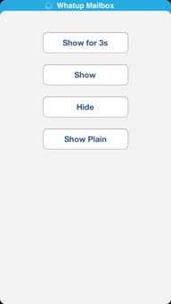

# FLStatusBarPopUp

Status Bar Messages for iOS like Mailbox App.

This is my first git so if you have any tipps or suggestions please let me know. So anyway.

FLStatusBarPopUp is a simple singelton class that you can use to show messages in place of the status bar like the mailbox app does.

## Installation

* Drag FLStatusBarPopUp.h/.m into your project

## Use

FLStatusBarPopUp *statusBarPopUpInstance = [FLStatusBarPopUp sharedFLStatusBarPopUp];

* [statusBarPopUpInstance showPopUpWithMessage:@"Whatup Mailbox" forDuration:3 stayInfinite:NO withActivityIndicator:YES];
* [statusBarPopUpInstance showPopUpWithMessage:@"Whatup Mailbox" forDuration:3 stayInfinite:YES withActivityIndicator:NO];
* [statusBarPopUpInstance dismissPopUp];

If you choose stayInfinite:YES the duration value will be ignored and you can dismiss the PopUp with dismissPopUp.
That's pretty much it. I put some more comments in the class itself.

Enjoy!

Fred  
@fredderli  
www.speedspot.com - Test & Find Fast WiFi
